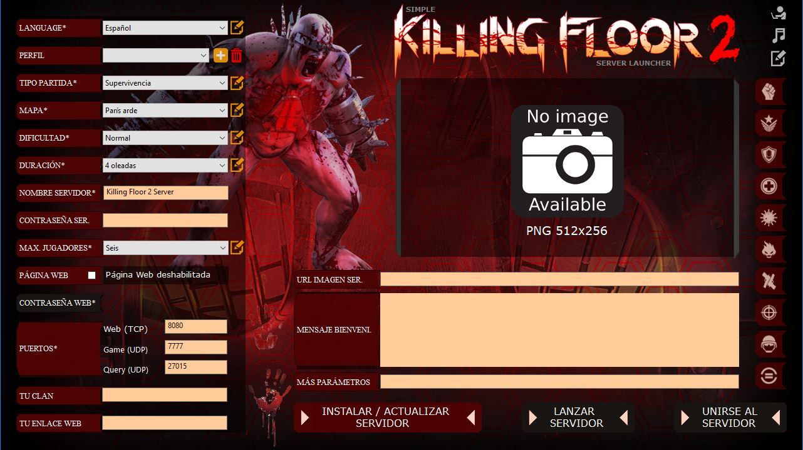
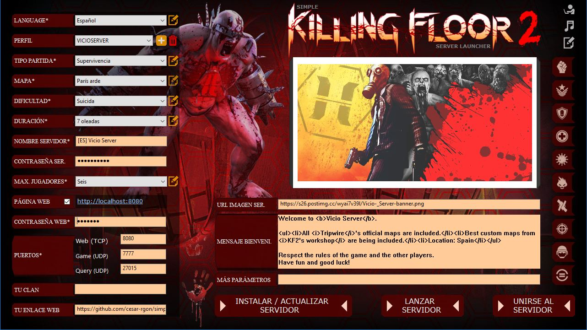

Simple Killing Floor 2 Server Launcher 
===============================================================

Aplicación que permite fácilmente personalizar y lanzar un servidor de Killing Floor 2 a través de una interfaz visual en lugar de editar ficheros batch o de configuración del servidor. Desarrollado con Autoplay Media Studio 8.

```
Versión: 1.2.2
Última fecha modificación: 22/04/2018
S.O. soportado: Microsoft Windows
Autor: César Rodríguez González
Idioma: Inglés, Español
```





El fichero "Simple-KF2server-launcher.zip" contiene los ficheros binarios para ejecutar la aplicación.

El fichero "Simple-KF2server-launcher.apz" es el proyecto fuente (necesita ser editado con Autoplay Media Studio si quieres hacer cambios en él).

##### Índice
> 1. [Pre-requisitos](#pre-requisitos)
> 2. [Instalar y ejecutar el lanzador](#instalar-y-ejecutar-el-lanzador)
> 3. [Entendiendo el lanzador](#entendiendo-el-lanzador)
> 4. [Anexo](#anexo)
>   - [A1. Agregar un mapa personalizado al Lanzador](#a1-agregar-un-mapa-personalizado-al-lanzador)
>   - [A2. Agregar el tipo de juego *Dificultad Controlada* al lanzador](#a2-agregar-el-tipo-de-juego-dificultad-controlada-al-lanzador)
>   - [A3. Argumentos de línea de comandos](#a3-argumentos-de-línea-de-comandos)
>   - [A4. Cómo ejecutar más de un servidor KF2 en el mismo ordenador](#a4-cómo-ejecutar-más-de-un-servidor-kf2-en-el-mismo-ordenador)
>   - [A5. Reproducir música cuando el lanzador es ejecutado](#a5-reproducir-música-cuando-el-lanzador-es-ejecutado)


### Pre-requisitos
- Descargar e instalar un servidor Killing Floor 2. Las instrucciones se encuentran [aquí][kf2server]. Para este documento, suponemos que la carpeta de instalación es: C:\kf2server (pero puede ser cualquier otra).
- Abrir los puertos necesarios en el router y firewall si quieres que el servidor sea visible desde internet.

### Instalar y ejecutar el lanzador
- Descargar el fichero binario desde [aquí][binary-launcher].
- Extraer el contenido del fichero Simple-KF2server-launcher.zip en la carpeta raíz del servidor Killing Floor 2.

Por ejemplo, el resultado sería:
```
C:\kf2server\Autoplay
C:\kf2server\autorun.exe
C:\fk2server\icon.ico
C:\kf2server\lua5.1.dll
C:\kf2server\lua51.dll
etc (Ficheros y carpetas del servidor Killing Floor 2)
```
- Crear un acceso directo en tu escritorio al fichero "autorun.exe".
- Ejecutar el acceso directo.

### Entendiendo el lanzador
**Perfil**: Este campo es opcional. Permite guardar los valores de campos (valores de filtros) por perfil. Si no hay perfil seleccionado, los campos no pueden ser guardados. Puedes agregar un nuevo perfil o eliminar uno seleccionado.


**Tipo de juego**: Este campo es obligatorio. Para administrar (añadir/modificar/borrar) los Tipos de Partida, edita el fichero de texto: AutoPlay\Docs\es\GameTypes.properties. Al menos debe existir un tipo de juego.


**Mapa**: Este campo es obligatorio. Para administrar (añadir/modificar/borrar) la lista de Mapas, edita el fichero de texto: AutoPlay\Docs\es\Maps.properties. Al menos debe existir un mapa.


**Dificultad**: Este campo es obligatorio si el tipo de juego no es igual a Semanal, desactivado en otro caso. Para administrar (añadir/modificar/borrar) la lista de Dificultades, edita el fichero de texto: AutoPlay\Docs\es\Difficulty.properties.


**Duración**: Este campo es obligatorio si el tipo de juego no es igual a Semanal o Sin Fin, desactivado en otro caso. Para administrar (añadir/modificar/borrar) la lista de Duraciones, edita el fichero de texto: AutoPlay\Docs\es\Length.properties.


**Nombre servidor**: Este campo es obligatorio. Debe contener al menos un caracter.


**Contraseña servidor**: Este campo es opcional.


**Max. jugadores**: Este campo es obligatorio. Para administrar (añadir/modificar/borrar) los Jugadores Máximos, edita el fichero de texto: AutoPlay\Docs\es\MaxPlayers.properties y AutoPlay\Docs\es\MaxPlayersVersus.properties.


**Página Web administración**: Si la página web está habilitada, se puede gestionar el servidor mediante ésta. El servidor Killing Floor 2 debe estar iniciando antes de que puedas acceder a la página web. La contraseña Web es obligatoria sólo si la página web está habilitada. Autenticación:
```
Usuario: admin
Contraseña: <Contraseña Web>
```


**Puertos**: Los Puertos son obligatorios. Necesitas abrir los puertos en tu router y firewall. Si se inicia más de un servidor, los puertos deben ser diferente entre ellos (un perfil por configuración de servidor).


**Tu clan**: Este campo es opcional.


**Tu enlace web**: Este campo es opcional.


**URL imágen del servidor**: Este campo es opcional. El enlace debe devolver una imágen subida a internet que será usada como una preview en el servidor Killing Floor 2. El formato y resolución debe ser PNG 512x256 pixeles.


**Mensaje bienvenida**: Este campo es opcional. Es un mensaje de bienvenida en la pantalla de inicio del servidor.


**Más parámetros**: Este campo es opcional. Define parámetros adicionales. El formato es: parametro1=valor1?parametro2=valor2?...?parametroN=valorN


**Idioma**: Este campo es obligatorio. Para administrar (añadir/modificar/borrar) la lista de Idiomas, edita el fichero de texto: AutoPlay\Docs\Language.properties


**Lanzar servidor**: Inicia un servidor Killing Floor 2 con los filtros especificados. Todos los campos obligatorios deben ser especificados. Si no hay perfil, los ficheros de configuración del servidor están localizados en la carpeta: KFGame\Config\\\_NoneProfile. Si se selecciona un perfil, los ficheros de configuración del servidor están localizados en la carpeta: KFGame\Config\\\PROFILENAME. De esta forma, los ficheros de configuración originales localizados en la carpeta: KFGame\Config nunca son modificados.


**Unirse al servidor**: Te unes a la partida de un servidor de Killing Floor 2 iniciado previamente. Si el servidor no ha sido iniciado, entrará al juego pero se quedará en el menú principal del mismo. Pre-requisitos: Tener instalados Steam y juego Killing Floor 2. Si no se especifica puerto de Juego (UDP) no podrá unirse al servidor. Si el servidor tiene contraseña y no se ha especificado la contraseña, no podrá unirse al mismo.


**Icono para editar ficheros PCServer-KFEngine.ini y PCServer-KFGame.ini**: Enlace que permite editar los dos ficheros principales de configuración de un servidor Killing Floor 2. Útil para, por ejemplo, agregar nuevos mapas personalizados.


**Icono para abrir carpeta música**: Enlace que abre la carpeta de música del lanzador de servidor de Killing Floor 2. Si se agregan ficheros de música a la carpeta, el lanzador las reproducirá, automáticamente, en bucle y aleatoriamente.


**Icono sobre el autor**: Enlace a pantalla con información de la versión y autor del lanzador.


### Anexo
#### A1. Agregar un mapa personalizado al Lanzador
##### Pre-requisitos
* Añadir el mapa personalizado al servidor de Killing Floor 2 de acuerdo a [estas][kf2server-custom-maps] instrucciones
* Iniciar el servidor y verificar que el mapa está disponible.

##### Agragar el mapa personalizado al lanzador
Edita el fichero de texto "AutoPlay\Docs\es\Maps.properties" y añade la siguiente línea al final del fichero:
```
KF-MapName=Nombre Mapa o Descripción
```

Por ejemplo:
```
KF-BikiniAtoll=Bikini Atoll
```


#### A2. Agregar el tipo de juego *Dificultad Controlada* al lanzador
##### Pre-requisitos
* Descargar el fichero "ControlledDifficulty.u" de [ésta][controlled-difficulty-realeases] página web.
* Copiar el fichero "ControlledDifficulty.u" a la carpeta "<KF2-Server-Root\>\KFGame\BrewedPC\Script\" tal como se explica en [ésta][controlled-difficulty-server] página web.

##### Agregar el tipo de juego *Dificultad Controlada* al lanzador
Editar el fichero de texto "AutoPlay\Docs\es\GameTypes.properties" y añade la siguiente línea al final del mismo:
```
ControlledDifficulty.CD_Survival=Dificultad Controlada
```

Opcionalmente, añade parámetros adicionales en la sección "Más parámetros". Los parámetros disponibles para el mod *Dificultad Controlada* están descritos en [ésta][controlled-difficulty-options] página web.

Por ejemplo:
```
MaxMonsters=30?CohortSize=15?SpawnMod=1?SpawnPoll=1
```


#### A3. Argumentos de línea de comandos
Los argumentos de línea de comandos aceptados son:
 ```
 autorun.exe --profiles PROFILENAME1 {PROFILENAME2 PROFILENAME3 ...}
```
{} significa: Opcional

Cuando especificas estos argumentos, el lanzador no será interactivo, es decir, carga y ejecuta cada perfil automáticamente sin necesidad de interacción por parte del usuario.

Por ejemplo:
```
autorun.exe --profiles MYPROFILE
```
El lanzador, en el arranque, cargará el perfil MYPROFILE y ejecutará el servidor automáticamente.

#### A4. Cómo ejecutar más de un servidor KF2 en el mismo ordenador
Necesitas un perfil por servidor. Cada perfil debería contener un nombre de servidor diferente para ser identificado. Además, cada perfil debe tener diferentes puertos entre ellos.

Por ejemplo: Dos servidores en el mismo ordenador
- PERFIL1: Nombre servidor: Mi Servidor 1; Puertos: 8080, 7777, 27015
- PERFIL2: Nombre servidor: Mi Servidor 2; Puertos: 8081, 7778, 27016

_Pasos (manera interactivo)_:
- Iniciar el lanzador
- Cargar perfil PROFILE1
- Lanzar servidor
- Cargar perfil PROFILE2
- Lanzar servidor

_Pasos (manera no interactiva)_:
- Crear un acceso directo con destino:
```
autorun.exe --profiles PROFILE1 PROFILE2
```
- Ejecutar el acceso directo

#### A5. Reproducir música cuando el lanzador es ejecutado
El lanzador reproducirá, en el inicio, ficheros de música localizados en la carpeta AutoPlay\Music. Los formatos aceptados son: .mp3, .ogg, etc.
La música se reproducirá en orden aleatorio y en bucle.

### Notas del autor
Espero que te sea de utilidad esta aplicación.

Por un jugador para jugadores :)

<!-- References -->
[kf2server]:https://wiki.tripwireinteractive.com/index.php?title=Dedicated_Server_%28Killing_Floor_2%29
[binary-launcher]:https://github.com/cesar-rgon/simple-kf2server-launcher/raw/master/Simple-KF2server-launcher.zip
[kf2server-custom-maps]:https://wiki.tripwireinteractive.com/index.php?title=Dedicated_Server_(Killing_Floor_2)#Setting_Up_Steam_Workshop_For_Servers
[controlled-difficulty-realeases]:https://github.com/notblackout/kf2-controlled-difficulty/releases
[controlled-difficulty-server]:https://github.com/notblackout/kf2-controlled-difficulty/blob/master/server.md
[controlled-difficulty-options]:https://github.com/notblackout/kf2-controlled-difficulty/blob/master/options.md
